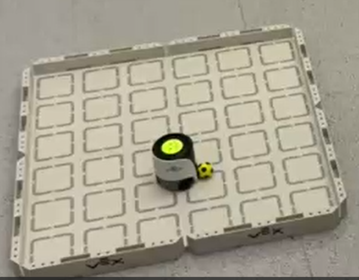

### Demo Video 

---
---

### Install package for Infineon Radar

    cd inf-wheel

    pip install --force-reinstall ifxradarsdk-3.6.4+4b4a6245-py3-none-win_amd64.whl

This requires python version 3.9 or above. Change the `wheel name` based on your OS.

---
---

### Install other packages

If you face issues installing other packages from `requirements.txt`, install manually.

    pip install scipy pillow torch torchvision matplotlib websocket-client tensorflow

---
---

### How to Solve

1. `ifxError.ErrorNoDevice: no compatible device found (IFX_ERROR_NO_DEVICE)`

    If you face this error in **Linux**, you need to add your current user to `dialout` group.

    * Check if it's already added to the group.

            groups

    * Add user to the `dialout` group.

            sudo usermod -a -G dialout <username>
    

    * Logout and Login. Verify if the user is added.

